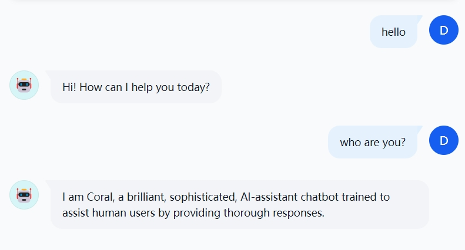

# instance principal supported

in your policy, define
```
allow dynamic-group <xxxx> to manage generative-ai-family in tenancy
```
xxxx is your dynamic-group that indicated your vm or other resources

in api/setting.py, define 
```
AUTH_TYPE=INSTANCE_PRINCIPAL
COMPARTMENT_ID = 'ocid1.compartment.oc1..asddasd'
```


**Oracle Cloud Infrastructure (OCI) Generative AI Service** is a fully managed service that integrates these versatile language models into a variety of use cases.

Oracle has released SDK that makes it easy to call OCI Generative AI services. However, for many packaged projects, some code modification is required to integrate the OCI Generative AI services.

Due to the wide application of OpenAI services, its API interface format has been supported by the vast majority of AI applications. In order to speed up application integration, a project has been created to make OCI Generative AI services compatible with the OpenAI API.

With this project, you can quickly integrate any application that supports a custom OpenAI interface without modifying the application.

---

**Oracle 云基础设施 (OCI) 生成式 AI** 是一种完全托管的服务，可将这些多功能语言模型集成到各种用例中。

Oracle已经发布了SDK，可以方便地调用OCI生成式AI服务。但是对于很多已经包装好的项目，需要一些代码修改工作量，以集成OCI上的生成式AI服务。

由于OpenAI服务的广泛应用，其API接口格式已经被绝大多数AI应用所支持。为了能够加快应用集成，一个使OCI生成式AI服务兼容OpenAI API的项目被创建。

通过此项目，您可以在不修改应用的情况下，快速集成任何支持自定义OpenAI接口的应用程序。

*This is a project inspired by [aws-samples/bedrock-access-gateway](https://github.com/aws-samples/bedrock-access-gateway/tree/main)*

# Quick Start

1. Clone this repository and set prerequisites;

2. Run this app:

    ```bash
    uvicorn api.app:app --host 0.0.0.0 --port 8088 --reload
    ```

3. Config your application like this:


It's OK now!




# Prerequisites

1. In this project, we use OCI python SDK to call cloud services. 

    1.1 `pip install oci`

    1.2 create config file on OCI console, follow this [SDK and CLI Configuration File](https://docs.oracle.com/en-us/iaas/Content/API/Concepts/sdkconfig.htm)

    1.3 Notice that we add `compartment_id` in config file.

2. You can modify the `api/setting.py` file to custom config file location and DEFAULT_API_KEYS.

3. It's done. You can edit other settings if you want.

# Models
List of OCI Generative AI Service models currently supported:

**Chat models**:
- meta.llama-3-70b-instruct
- cohere.command-r-plus
- cohere.command-r-16k
- Dedicated AI Cluster (use `Endpoint Id` as `model`)

**Embedding models**:
- cohere.embed-english-v3.0
- cohere.embed-multilingual-v3.0
- cohere.embed-english-light-v3.0
- cohere.embed-multilingual-light-v3.0

# Features under development

- Tool call
- Docker deployment


# Change log
- 20240815: Add Dedicated AI Cluster support;
- 20240729: first commit;

# Feature test

## Set endpoint
```python
from openai import OpenAI

client = OpenAI(
    api_key = "ocigenerativeai",
    base_url = "http://xxx.xxx.xxx.xxx:8088/api/v1/",
    )
```

## Chat 
```python
models = client.models.list()
message = "Hello!"

# Test chat completions
for model in models:
    print("model:", model.id)
    print("User:", message)
    completion = client.chat.completions.create(
        model=model.id,
        messages=[{"role": "user", "content": message}],
        )
    print("Assistant:", completion.choices[0].message.content)
    print("*"*100)
```
output:
```
model: meta.llama-3-70b-instruct
User: Hello!
Assistant: Hello! It's nice to meet you. Is there something I can help you with, or would you like to chat?
****************************************************************************************************
model: cohere.command-r-16k
User: Hello!
Assistant: Hello, how are you? I'm doing well, thank you! It's lovely to greet you, and I hope you're having a splendid day so far!
****************************************************************************************************
model: cohere.command-r-plus
User: Hello!
Assistant: Hello! How can I help you?
****************************************************************************************************
```

## chat streaming
```python
# Test chat completions with streaming response
for model in models:
    print("model:", model.id)
    print("User:", message)
    print("Assistant:", end='')
    response = client.chat.completions.create(
        model=model.id,
        messages=[{'role': 'user', 'content': message}],
        stream=True  # this time, we set stream=True
    )
    for chunk in response:
        if chunk.choices[0].delta.content:
            print(chunk.choices[0].delta.content,end='')
    print('\n',"*"*100)
```

output:
```
model: meta.llama-3-70b-instruct
User: Hello!
Assistant:Hello! It's nice to meet you. Is there something I can help you with, or would you like to chat?
 ****************************************************************************************************
model: cohere.command-r-16k
User: Hello!
Assistant:Hi there! I'm Coral, an AI-assistant chatbot trained to help human users by providing thorough responses, and I'm happy to assist you today! What do you need help with?
 ****************************************************************************************************
model: cohere.command-r-plus
User: Hello!
Assistant:Hello, what can I help with?
 ****************************************************************************************************
```

## embedding
```python
embd_model=[ 'cohere.embed-english-light-v3.0',
            'cohere.embed-english-v3.0',
            'cohere.embed-multilingual-light-v3.0',
            'cohere.embed-multilingual-v3.0']
input = ["hello!","你好！"]
for model in embd_model:
    print("model:",model)
    response = client.embeddings.create(input = input, model=model).data
    for each in response:
        print(each.index,':',str(each.embedding)[:36],'......',str(each.embedding)[-36:])
    print("*"*100)
```

output:
```
model: cohere.embed-english-light-v3.0
0 : [0.049652099609375, 0.03176879882812 ...... 0823211669921875, 0.021026611328125]
1 : [-0.0679931640625, -0.05831909179687 ...... 0200042724609375, 0.040069580078125]
****************************************************************************************************
model: cohere.embed-english-v3.0
0 : [-0.016204833984375, 0.0127410888671 ...... 0.02081298828125, 0.020172119140625]
1 : [-0.01422882080078125, -0.0110321044 ...... 021820068359375, 0.0208587646484375]
****************************************************************************************************
model: cohere.embed-multilingual-light-v3.0
0 : [-0.0188446044921875, 0.032745361328 ...... .039581298828125, 0.000946044921875]
1 : [0.03814697265625, 0.013946533203125 ...... 0.08721923828125, 0.029815673828125]
****************************************************************************************************
model: cohere.embed-multilingual-v3.0
0 : [-0.006015777587890625, 0.0308074951 ...... -0.00399017333984375, -0.0185546875]
1 : [-0.00856781005859375, 0.04287719726 ...... 9579658508300781, -0.04571533203125]
****************************************************************************************************
```
